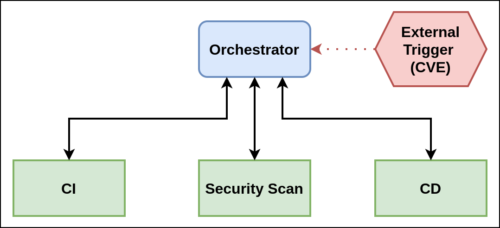
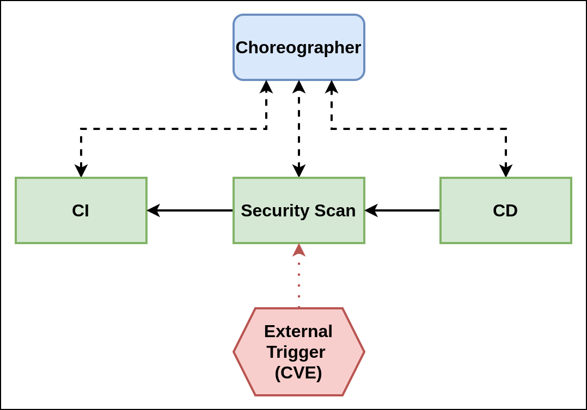

##### Easily build Cloud Native Supply Chains

VMware Tanzu Application Platform (TAP) uses Supply Chain Choreographer which is based on the open-source Cartographer, to allow App Operators to create pre-approved paths to production by integrating Kubernetes resources with the elements of their existing toolchains.

```dashboard:open-url
url: https://cartographer.sh
```

Each pre-approved supply chain creates a paved road to production that allows developers to focus on delivering value to their users and provides App Operators the assurance that all code in production has passed through all the steps of an approved workflow.

##### Design and Philosophy

Cartographer allows operators via the Supply Chain abstraction to define all of the steps that an application must go through to create an image and Kubernetes configuration.

Contrary to many other Kubernetes native workflow tools that already exist in the market, Cartographer does not “run” any of the objects themselves. Instead, it monitors the execution of each resource and templates the following resource in the supply chain after a given resource has completed execution and updated its status.

##### Choreography vs Orchestration

In the orchestration model, which is used by most of the current CI/CD tools like Jenkins or Tekton, an orchestrator executes, monitors, and manages each of the steps of the path to production. The CI stage, or any others, could not function independently from the orchestrator. In the case of a path to production with a vulnerability scanning step, if a new CVE should arise, the only way to scan the code for it would be to trigger the orchestrator to initiate the scanning step or a new run through the supply chain.



In the choreography model, each step of the path to production and the tool required for that step knows nothing about the next step. It is responsible for receiving a signal that it must perform some work, completing it, and signaling that it has finished. In the same case as above, with a pipeline that has a vulnerability scanner, if there is a new CVE, the vulnerability scanner would know about it and trigger a new scan. When the scan is complete, the vulnerability scanner will send a message indicating that scanning is complete.



Because steps of the path to production are rarely synchronous, for example, if a new CVE comes up, someone clicks the button on a build, and so on, choreography is a natural choice as a workflow engine. Flexibility and the ability to swap steps of the path to production is also of extreme importance.

A more detailed explanation is available here:

```dashboard:open-url
url: https://tanzu.vmware.com/developer/guides/supply-chain-choreography/
```

##### Separation of Concerns

While the supply chain is operator facing, Cartographer also provides an abstraction for developers called Workloads. Workloads allow developers to create application specifications such as the location of their repository, environment variables, and service claims.

##### Reusable CI/CD

By design, a supply chain can be used by many workloads of a specific type, like any web application. This allows an operator to specify the steps in the path to production a single time and for developers to specify their applications independently but for each to use the same path to production. The intent is that developers are able to focus on providing value for their users and can reach production quickly and easily while providing peace of mind for app operators, who are ensured that each application has passed through the steps of the path to production that they've defined.


To enable app operators to consistently apply runtime configurations to fleets of workloads of a specific type implemented in different technologies, Convention Service is another component of TAP that is not yet available as OSS.

```dashboard:open-url
url: https://docs.vmware.com/en/VMware-Tanzu-Application-Platform/1.3/tap/GUID-convention-service-about.html
```

##### Kubernetes Resource Interoperability

With Cartographer, it's possible to choreograph both Kubernetes and non-Kubernetes resources within the same supply chain via integrations to existing CI/CD pipelines like Tekton by using the Runnable Custom Resource Definition (CRD).

##### The Core of VMware Tanzu Application Platform

TAP provides a full integration of all of its components via out of the box Supply Chains that can be customized for customers' processes and tools.

Let's now explore the two fundamental resources that an operator deploys, Supply Chains and Templates, and how these interact with the resource a developer deploys, the Workload. We'll do this hands-on with an example of a simple supply chain that watches a Git repository for changes, builds a container image, and deploys it to the cluster.

###### Supply Chain: 

With a ClusterSupplyChain, app operators describe which “shape of applications” they deal with (via spec.selector), and what series of resources are responsible for creating an artifact that delivers it (via spec.resources).

Those Workloads that match spec.selector then go through the resources specified in spec.resources

```execute
kubectl get clustersupplychain -n tap-install
```

###### ClusterSourceTemplate:

ClusterSourceTemplate indicates how the supply chain could instantiate an object responsible for providing source code.

The ClusterSourceTemplate requires definition of a urlPath and revisionPath. ClusterSourceTemplate will update its status to emit url and revision values, which are reflections of the values at the path on the created objects.

```execute
kubectl get ClusterSourceTemplate -n tap-install
```

GitRepository:

```execute
kubectl get GitRepository -n tap-install
```

ImageRepository

```execute
kubectl get ImageRepository -n tap-install
```

SourceScan

```execute
kubectl get SourceScan -n tap-install
```

source-template:

```execute
kubectl get ClusterSourceTemplate source-template -n tap-install
```

testing-pipeline:

```execute
kubectl get ClusterSourceTemplate source-template -n tap-install
```

Runnable:

```execute
kubectl get Runnable -n tap-install
```

###### ClusterImageTemplate:

ClusterImageTemplate instructs how the supply chain should instantiate an object responsible for supplying container images, for instance, one that takes source code, builds a container image out of it.

The ClusterImageTemplate requires definition of an imagePath. ClusterImageTemplate will update its status to emit an image value, which is a reflection of the value at the path on the created object.

```execute
kubectl get ClusterImageTemplate -n tap-install
```

ImageScan

```execute
kubectl get ImageScan -n tap-install
```

###### ClusterConfigTemplate:

Instructs the supply chain how to instantiate a Kubernetes object that knows how to make Kubernetes configurations available to further resources in the chain.

The ClusterConfigTemplate requires definition of a configPath. ClusterConfigTemplate will update its status to emit a config value, which is a reflection of the value at the path on the created object.

```execute
kubectl get ClusterConfigTemplate -n tap-install
```

###### ClusterTemplate:

A ClusterTemplate instructs the supply chain to instantiate a Kubernetes object that has no outputs to be supplied to other objects in the chain, for instance, a resource that deploys a container image that has been built by other ancestor resources.

```execute
kubectl get ClusterTemplate -n tap-install
```

```execute
kubectl get deliverable -n tap-install
```

###### ClusterRunTemplate:

A ClusterRunTemplate defines how an immutable object should be stamped out based on data provided by a Runnable. ClusterRunTemplate differs from supply chain templates in many aspects:

ClusterRunTemplate cannot be referenced directly by a ClusterSupplyChain object (it can only be reference by a Runnable)

```execute
kubectl get ClusterRunTemplate -n tap-install
```

commit-and-pr-pipelinerun

```execute
kubectl get TaskRun -n tap-install
```

tekton-source-pipelinerun

```execute
kubectl get PipelineRun -n tap-install
```

###### Pipeline

```execute
kubectl get pipeline -n tap-install
```

###### Scanpolicy

```execute
kubectl get scanpolicy -n tap-install
```
