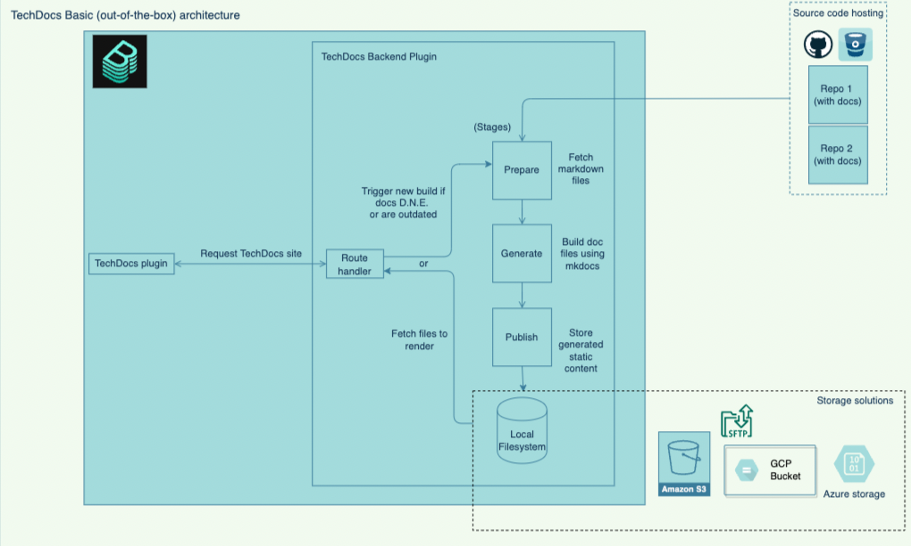
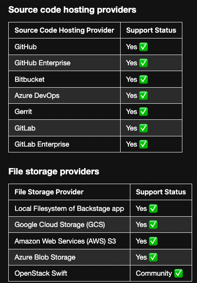

#### Tech Docs: 

TechDocs is Spotify’s homegrown docs-like-code solution built directly into Backstage. Engineers write their documentation in Markdown files which live together with their code - and with little configuration get a nice-looking doc site in Backstage.


```dashboard:open-url
url: https://tap-gui.workshop.tap.tanzupartnerdemo.com/docs/default/component/tap-gui-component
```

###### TechDocs plugin - VMware Docs

```dashboard:open-url
url: https://docs.vmware.com/en/VMware-Tanzu-Application-Platform/1.3/tap/GUID-tap-gui-techdocs-usage.html
```

###### Architecture - TechDocs



```dashboard:open-url
url: https://backstage.io/docs/features/techdocs/architecture#recommended-deployment
```

###### Supported providers


