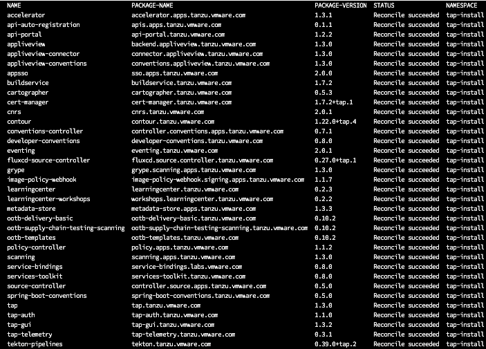

<p style="color:blue"><strong> Review Tap values file </strong></p>

```execute
cat $HOME/tap-values.yaml
```

<p style="color:blue"><strong> Add the package repository </strong></p>

```execute
sudo tanzu package repository add tanzu-tap-repository --url tapworkshopoperators.azurecr.io/tap1.3/tap-demo/tap-packages:1.3.2 --namespace tap-install
```


<p style="color:blue"><strong> Get the status of the TAP package repository, and ensure the status updates to Reconcile succeeded </strong></p>

```execute
sudo tanzu package repository get tanzu-tap-repository --namespace tap-install
```


<p style="color:blue"><strong>  List the available packages </strong></p>

```execute
sudo tanzu package available list --namespace tap-install
```

<p style="color:blue"><strong> Install Tanzu package with full profile</strong></p>

```execute
sudo tanzu package install tap -p tap.tanzu.vmware.com -v 1.3.2 --values-file $HOME/tap-values.yaml -n tap-install
```


Note: This process takes about 5-10 mins to complete. If you see any reconcile errors, please let us know.

After successful installation: 

<p style="color:blue"><strong> List the packages installed </strong></p>

```execute
sudo tanzu package installed list -A
```

<p style="color:red"><strong> Proceeed further only once all the packages are reconciled successfully </strong></p>


