Supply Chain Choreographer is based on open source Cartographer. It allows App Operators to create pre-approved paths to production by integrating Kubernetes resources with the elements of their existing toolchains, for example, Jenkins.

Each pre-approved supply chain creates a paved road to production. Orchestrating supply chain resources - test, build, scan, and deploy - allows developers to focus on delivering value to their users and provides App Operators the assurance that all code in production has passed through all the steps of an approved workflow.

Out of the box supply chains are provided with Tanzu Application Platform and the following three supply chains are included: 

     - Out of the Box Supply Chain Basic
      
     - Out of the Box Supply Chain with Testing
      
     - Out of the Box Supply Chain with Testing and Scanning
      
TAP also includes Out of the Box Templates and Out of the Box Delivery Basic. 

##### For this workshop, we have deployed TAP using OOTB supply chain with testing and scanning. 

```editor:open-file
file: ~/tap-values.yaml
line: 14
```

<p style="color:blue"><strong> List the supply chains </strong></p>

```execute
tanzu apps cluster-supply-chain list
```

<p style="color:blue"><strong> Check the Scanpolicy resource </strong></p>

```execute
kubectl get ScanPolicy -n tap-install
```

<p style="color:blue"><strong> Check the Pipeline resource </strong></p>

```execute
kubectl get Pipeline -n tap-install
```

<p style="color:blue"><strong> Connect to TAP GUI </strong></p>

```dashboard:open-url
url: http://tap-gui.{{ session_namespace }}.demo.tanzupartnerdemo.com/supply-chain/host/tap-install/{{ session_namespace }}
```

There are two sections within this view:

Graph view at the top, which shows all the configured CRDs used by this supply chain and any artifacts that are outputs of the supply chain’s execution

Stage details view at the bottom, which shows source data for each part of the supply chain that you select in the graph view

###### click on various stages in supply chain to understand better

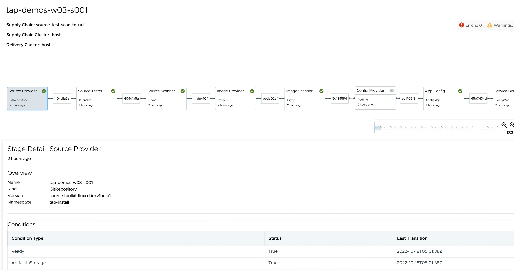

Each stage in the supply chain independently determines when its source inputs have changed, and whether it needs to take reconciliation steps to ensure that the application deployment is compliant.

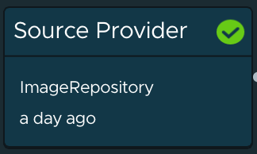

The supply chain begins at the source provider step, where it will be monitoring the Git source code repo that was specified in the workload. It will supply the application source to subsequent steps in the supply chain, and continuously monitor for subsequent updates (commits) to the source.

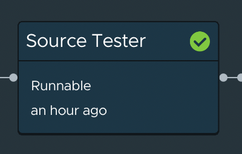

The **Source Tester** step is responsible for doing source code tests. It uses a Tekton pipeline to run the source code checks and required tests needs to be codified. 

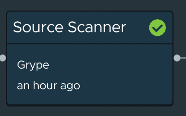

The **Source Scanner** step is responsible for doing source code scans using **Grype**.

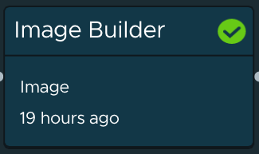

The **Image Builder** step is responsible for producing the container image runtime for the application. The default implementation of Image Builder uses **Tanzu Build Service**. We saw how Tanzu Build Service simplified container creation for Cody the developer during iterative development, but it is especially powerful when used in a Supply Chain. Tanzu Application platform continually publishes security fixes and version updates for the buildpacks and OS images used for container creation, and it can automatically trigger patching and rebuilds of the container images without any intervention from developers or operators.

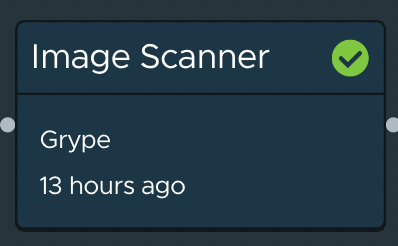

The **Image Scanner** step is responsible for scanning container images build in previous step by Tanzu Build Service (TBS). The default implementation of image scanner users **Grype** with an additional option using **Snyk**. You can define the image scanning policy and also define what level of vulerabilities can be skipped.

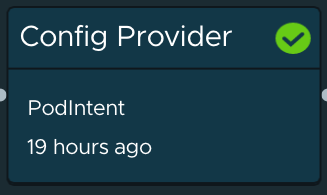

The **Config Provider** step uses a Tanzu Application Platform component called **Convention Service**. Convention Service allows you to specify customizations to Kubernetes resources that will automatically be enforced on every workload that runs through the supply chain. The number of customizations you can apply is endless, but examples include:
* Embedding a container sidecar in the application pod, to implement required capabilities like antivirus scanning or log export to Splunk
* Attaching an expense code label to the deployment resource, to cost tracking and chargeback
* Budgeting memory and CPU for the deployment

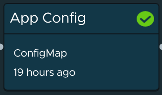

The **App Config** step will output a complete specification of the Kubernetes resources needed to deploy the application onto a target cluster. The default implementation uses a Knative service for deployment, which simplifies zero-downtime updates and autoscaling. The resources generated here will include the reference to the container image produced by **Tanzu Build Service**, and the customizations provided by **Convention Service**

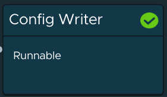

The **Config Writer** step of the supply chain is to output the deployment specification to a GitOps repo, to easily manage promotion to environments like QA, Staging, and Production.


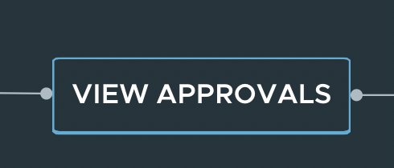

The View Approval step of the supply chain gives an opportunity to review the changes before they are applied on a run as cluster as part of **Continuous Delivery** process.

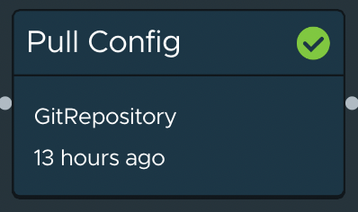

The **Pull Config** step of the supply chain pull's the yaml file from github repository which was written as part of **config writer** step. This yaml file can be taken to any TAP run cluster and applied to run the application.


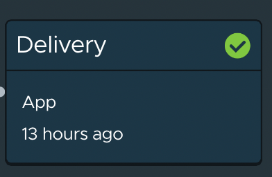

The **Delivery** step of the supply chain apply the yaml file on a cluster. This step uses **kapp** to deploy the app on a TAP cluster.


For more detailed info reg supply chains, please refer to official vmware doc: 

```dashboard:open-url
url: https://docs.vmware.com/en/VMware-Tanzu-Application-Platform/1.3/tap/GUID-scc-ootb-supply-chain-testing-scanning.html
```
