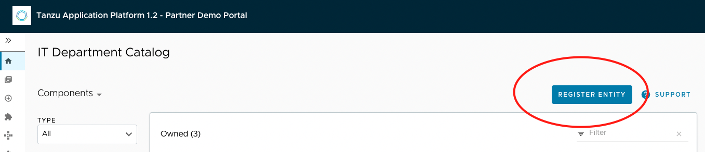
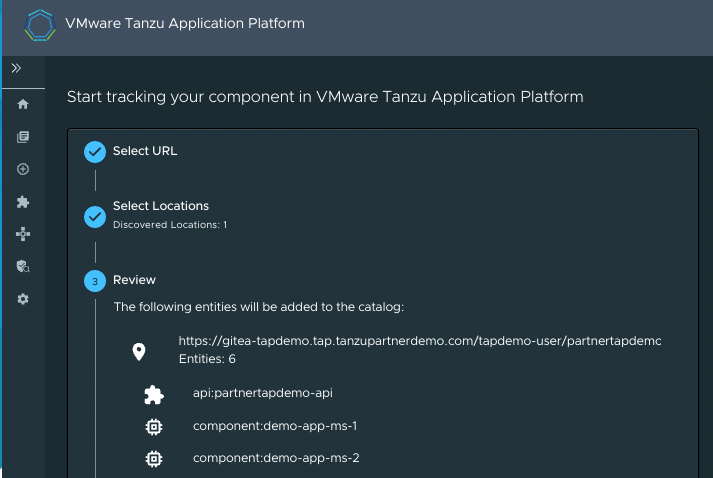
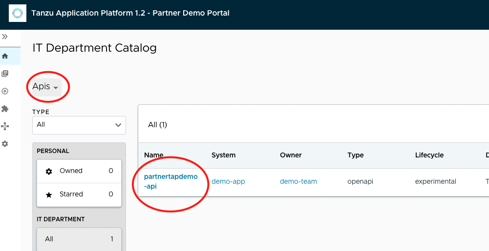

#### API Docs - Plugin

The API documentation plug-in provides a standalone list of APIs that can be connected to components and systems of the Tanzu Application Platform GUI software catalog. Each API entity can reflect the components that provide that API and the list of components that are consumers of that API. 

The API documentation plug-in is part of Tanzu Application Platform GUI.

##### VMWare Docs - API Docs

```dashboard:open-url
url: https://docs.vmware.com/en/VMware-Tanzu-Application-Platform/1.3/tap/GUID-tap-gui-plugins-api-docs.html
```

Access below tap-gui url and register an entity

```dashboard:open-url
url: http://tap-gui.{{ session_namespace }}.demo.tanzupartnerdemo.com/catalog
```



 - Repository url: https://gitea-tapdemo.tap.tanzupartnerdemo.com/tapdemo-user/partnertapdemo/raw/branch/main/catalog-info-apidocs.yaml

 - Analyze

 - Import




```dashboard:open-url
url: http://tap-gui.{{ session_namespace }}.demo.tanzupartnerdemo.com/catalog
```

Change the filter to APIs as shown below: 



Access the api to view the provider and consumer micro services: 

```dashboard:open-url
url: http://tap-gui.{{ session_namespace }}.demo.tanzupartnerdemo.com/catalog/default/api/partnertapdemo-api
```

Navigate to the API page by clicking APIs on the left-hand side navigation panel. The catalog changes and entries are visible for further inspection. If you select the system demo-app, the diagram appears as follows:

```dashboard:open-url
url: http://tap-gui.{{ session_namespace }}.demo.tanzupartnerdemo.com/catalog/default/system/demo-app/diagram
```

By choosing the Definition tab on the top of the API page, you can see the definition of that API in human-readable and machine-readable format.

```dashboard:open-url
url: http://tap-gui.{{ session_namespace }}.demo.tanzupartnerdemo.com/catalog/default/api/partnertapdemo-api/definition
```

##### Supported API Formats: 

OpenAPI 2 & 3

AsyncAPI

GraphQL

Plain (to support any other format)
