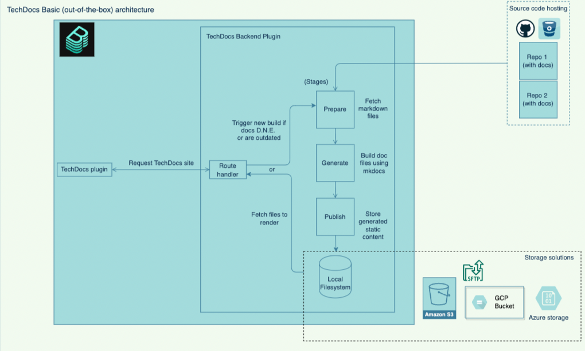
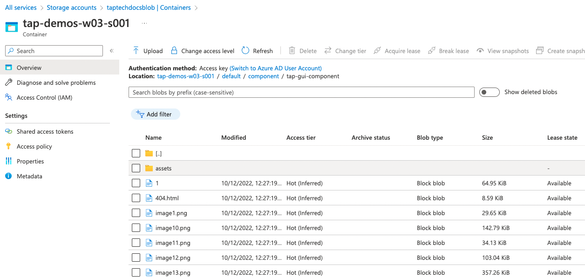
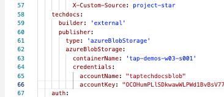
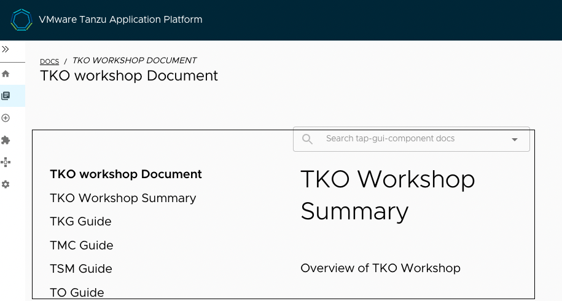
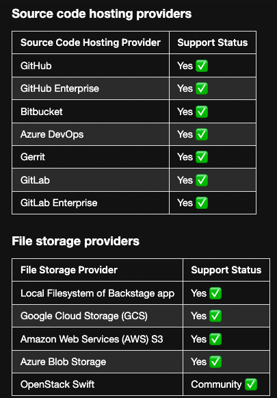

#### Tech Docs: 

TechDocs is Spotify’s homegrown docs-like-code solution built directly into Backstage. Engineers write their documentation in Markdown files which live together with their code - and with little configuration get a nice-looking doc site in Backstage.


```dashboard:open-url
url: http://tap-gui.{{ session_namespace }}.demo.tanzupartnerdemo.com/docs/default/component/tap-gui-component
```

###### TechDocs plugin - VMware Docs

```dashboard:open-url
url: https://docs.vmware.com/en/VMware-Tanzu-Application-Platform/1.3/tap/GUID-tap-gui-techdocs-usage.html
```

###### Architecture - TechDocs



```dashboard:open-url
url: https://backstage.io/docs/features/techdocs/architecture#recommended-deployment
```

```execute
node -v
```

```execute
npm -v
```

```execute
cd /home/eduk8s/tanzudocs/site-component && ls
```

###### Dont need to run this

```execute
#npx @techdocs/cli generate --source-dir /home/eduk8s/tanzudocs/blank  --output-dir /home/eduk8s/tanzudocs/site-component
```

**Note:** For this workshop, we have already generated and published the required files into: **/home/eduk8s/tanzudocs/site-component**

```execute
#npx @techdocs/cli publish --publisher-type azureBlobStorage --storage-name {{ session_namespace }} --azureAccountName taptechdocsblob --azureAccountKey OCOHumPLlSDkwawWLPWd1BvBsV77Lib95Dh5xuiIFfBz4kwHSVPLnaeEVUIJQJolAYzvPa29/RYG+AStDcv2Gg== --entity default/Component/tap-gui-component --directory /home/eduk8s/tanzudocs/site-component
```

Expected output: 

info: Creating Azure Blob Storage Container publisher for TechDocs
info: Successfully uploaded all the generated files for Entity tap-gui-component. Total number of files: 128
info: Successfully deleted stale files for Entity tap-gui-component. Total number of files: 0



###### Remove (#) from lines 60 - 68 of tap-values.yaml

```editor:open-file
file: /home/eduk8s/tap-values.yaml
```



###### Refresh the packages with updated tap-values file

```execute
sudo tanzu package installed update tap -f $HOME/tap-values.yaml -n tap-install
```

###### Access the Tech Docs in TAP-GUI 

```dashboard:open-url
url: http://tap-gui.{{ session_namespace }}.demo.tanzupartnerdemo.com/docs/default/component/tap-gui-component
```

**Note:** Successful update will reflect the docs in TAP GUI as shown below: 



###### Supported providers - FYI


