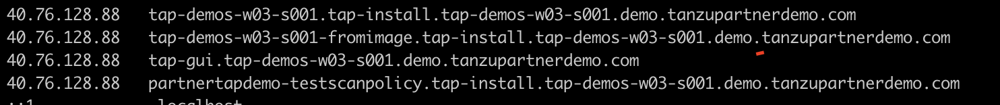

###### Delete the accelerator 

```execute
tanzu accelerator delete {{ session_namespace }}
```

###### List the workloads

```execute
tanzu apps workload list -n tap-install
```

###### Delete the workload {{ session_namespace }}

```execute
tanzu apps workload delete {{ session_namespace }} -n tap-install -y
```

###### Delete the workload {{ session_namespace }}-fromimage

```execute
tanzu apps workload delete {{ session_namespace }}-fromimage -n tap-install -y
```

###### Delete the workload partnertapdemo-testscanpolicy

```execute
tanzu apps workload delete partnertapdemo-testscanpolicy -n tap-install -y
```

###### List the workloads

```execute
tanzu apps workload list -n tap-install
```

###### Delete the TAP Package, this process takes around 3-4 mins to complete. 

```execute
sudo tanzu package installed delete tap -n tap-install -y
```

###### Clear the DNS entries created in previous sections: 

-   {{ session_namespace }}.tap-install.{{ session_namespace }}.demo.tanzupartnerdemo.com
-   {{ session_namespace }}-fromimage.tap-install.{{ session_namespace }}.demo.tanzupartnerdemo.com
-   tap-gui.{{ session_namespace }}.demo.tanzupartnerdemo.com
-   partnertapdemo-testscanpolicy.tap-install.{{ session_namespace }}.demo.tanzupartnerdemo.com



###### Delete the Kubernetes cluster

```execute
az aks delete --name {{ session_namespace }}-cluster --resource-group tapdemo-cluster-RG -y
```
